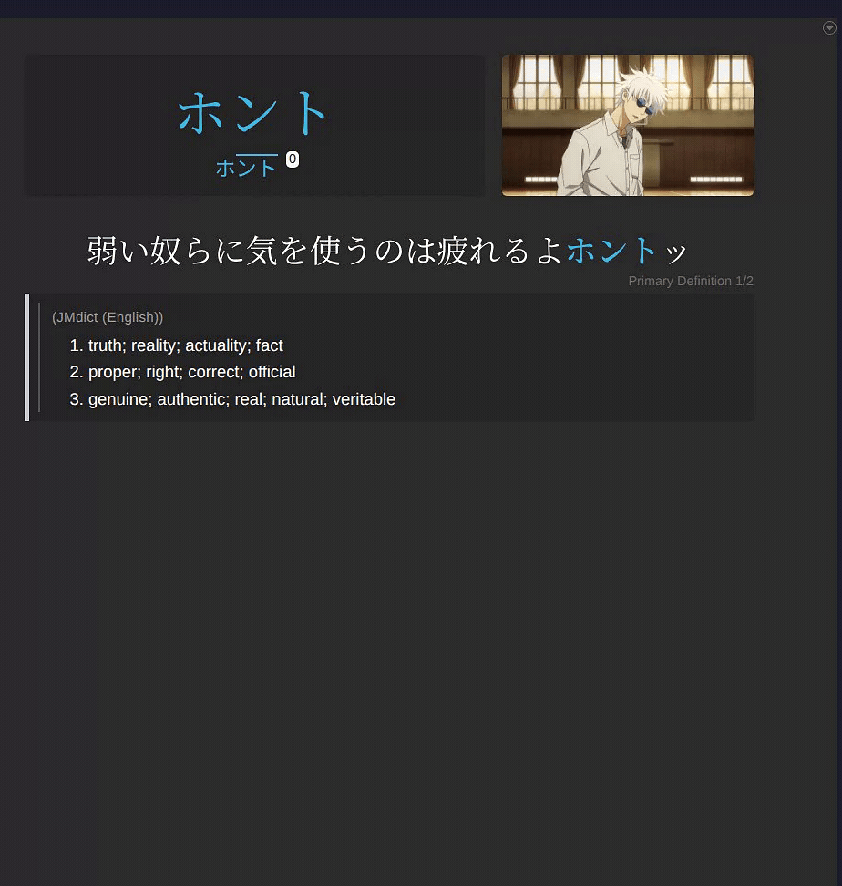

<h1 align="center">Anki Miner Note</h1>

An Anki note type for sentence mining in every language <a href="https://github.com/0xzerolight/anki_miner">Anki Miner</a> mines.

⬇️ <a href="https://raw.githubusercontent.com/0xzerolight/anki_miner_note/main/assets/example_card.mp4">MP4 (sound)</a>

## Installation

### Requirements

- **Anki** 23.10 or later
- **[Anki Miner](https://github.com/0xzerolight/anki_miner)** to fill the cards

1. Download `Anki-Miner-Note-*.apkg` from the [latest release](https://github.com/0xzerolight/anki_miner_note/releases/latest).
2. In Anki, choose **File** -> **Import** and pick the file. This adds the **Anki Miner Note** note type and an example deck.
3. In Anki Miner, open **Settings** -> **Cards & Anki**, select the **Anki Miner Note** note type, then click **Fill in automatically**.

### Updating

Import the new `.apkg` with **Merge note types** ticked and **Update note types** set to **Always**. Your notes and their fields are kept. Edits you made to the Styling are replaced, so copy them first and re-apply them after.

## Features

- Lapis's Japanese card - furigana, pitch accent display and the same card types.
- Per-language fields - pinyin, jyutping, hanja, gender, plural, root and more, shown only when filled.
- Gender colours on noun chips.
- Sentence translation under the sentence.
- Right-to-left layout for Arabic, Persian and Hebrew.
- Regional fonts, so Chinese, Japanese and Korean characters take the right shapes.
- Light and night mode, on desktop and phone.

<strong>Per-language fields (22)</strong>

- **Chinese** - Pinyin, Traditional, MeasureWord
- **Cantonese** - Jyutping, MeasureWord
- **Korean** - Hanja
- **Vietnamese** - HanViet
- **Thai** - Classifier
- **Arabic** - Root, Grammar, Segmentation
- **Persian** - Romanization, Colloquial, PresentStem
- **Hebrew** - Transliteration, Root, Binyan, Gender, Plural
- **Indonesian** - Root, Affixes, Formal
- **German** - PartOfSpeech, Gender, Plural
- **Danish, Dutch, Italian, Norwegian Bokmål** - PartOfSpeech, Gender, Article
- **Swedish** - PartOfSpeech, Article
- **Croatian, Greek, Polish, Russian, Slovenian, Ukrainian** - PartOfSpeech, Gender, AspectPair
- **Catalan, French, Lithuanian, Portuguese, Romanian, Spanish** - PartOfSpeech, Gender
- **English, Finnish, Hungarian, Turkish** - PartOfSpeech

Japanese uses Lapis's own fields.

## Card Types

Put any text, such as `x`, in one `Is…Card` field to change the front of the card. Leave them all empty for a word card.

| Field | Front of the card |
|---|---|
| None | The word |
| `IsWordAndSentenceCard` | The word, with the sentence below it |
| `IsClickCard` | The word; click it to show the sentence |
| `IsSentenceCard` | The whole sentence |
| `IsAudioCard` | The sentence audio, and the sentence with the word missing |

## Language

The `Language` field takes a language tag: `ja`, `zh-Hans`, `zh-Hant`, `yue`, `ko`, `ar`, `fa`, `he`, `th`, `de`, and so on.
Left empty, the card guesses the language from the word and sentence.

## Fonts

The card uses fonts already on your device. To change them, edit these variables at the top of the note type's Styling: `--latin-serif`, `--latin-sans`, `--cjk-serif` and `--cjk-sans`. Japanese cards keep Lapis's stacks, so only `--cjk-serif` and `--cjk-sans` change them. The stacks for Chinese, Cantonese, Korean, Arabic, Persian, Hebrew and Thai are in the LANGUAGES section at the end of the Styling.
Lapis's other settings still apply; see [docs/user_settings.md](docs/user_settings.md).

## Acknowledgements

- Anki Miner Note is a fork of [Lapis](https://github.com/donkuri/lapis) adapted to all languages. Thank you to the creators of Lapis for creating such an amazing note type.

## License

GNU General Public License v3.0. See [LICENSE](LICENSE).
